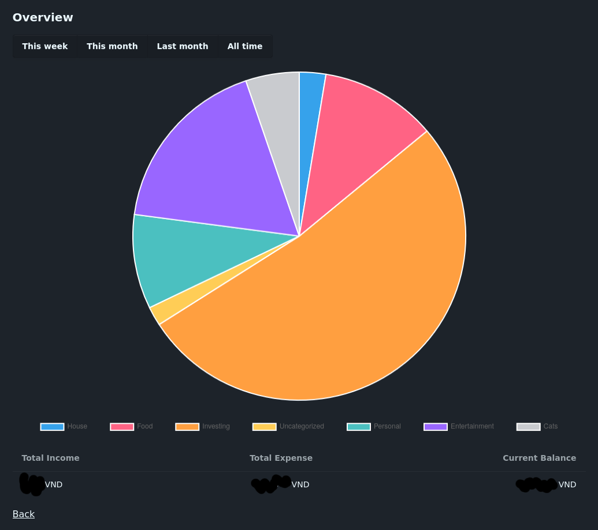
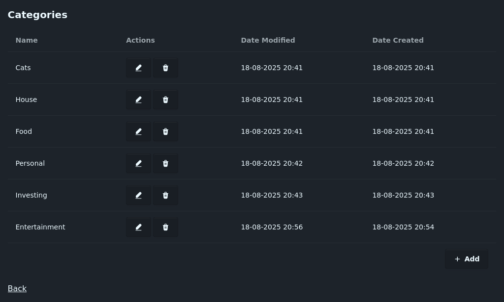
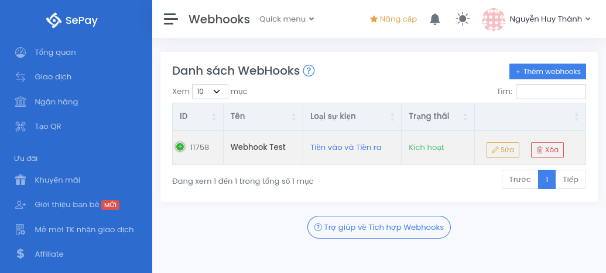

# Sifintra

Simple Finance Tracker.

## Screenshots

<details>
  <summary><code>/overview</code></summary>

  
</details>

<details>
  <summary><code>/transactions</code></summary>

  
</details>

<details>
  <summary><code>/categories</code></summary>

  
</details>

## Usage

There is a Docker image ready at `thanhnguyen2187/sifintra`. Run it anywhere you
want. Remember to mount `/data` to persist the data.

```shell
docker pull thanhnguyen2187/sifintra:latest

docker run \
    -p 3000:3000 \
    -v /tmp/data:/data \
    thanhnguyen2187/sifintra:latest \
;
```

## Development

Technical stack:

- Moon: task runner and monorepo management
- Rust + Axum: backend
- SvelteKit + DaisyUI: frontend

### Backend

- Make sure that Rust is available (`cargo`, `rustc`, etc.)

- Make sure that and `diesel` is available:

```shell
cargo install diesel_cli \
    --no-default-features \
    --features sqlite-bundled

export PATH=$PATH:/home/thanh/.cargo/bin

diesel --version
# diesel
#  Version: 2.2.12
#  Supported Backends: sqlite
```

- Make sure that `packages/backend/.env` is ready with `DATABASE_URL`
  points to a valid SQLite3 database file:

```shell
DATABASE_URL=sifintra.db
```

- Run migrations:

```shell
diesel setup
```

- Start the server:

```shell
moon backend:serve
```

Equivalent to moving into `packages/backend`, then

```shell
cargo run
# 2025-08-17T11:59:19.105350Z  INFO backend: Listening on http://127.0.0.1:3000
```

### Frontend

- Make sure that `pnpm` is available:

```shell
pnpm --version
# 10.12.1
```

- Install dependencies:

```shell
moon 
```

- Make sure that `packages/app/.env` is ready with `PUBLIC_API_BASE_URL` points
  to the backend development endpoint:

```
PUBLIC_API_BASE_URL=http://localhost:3000
```

- Start development server:

```shell
pnpm run dev
#  VITE v7.1.1  ready in 1065 ms
#
#  ➜  Local:   http://localhost:5173/
#  ➜  Network: use --host to expose
#  ➜  press h + enter to show help
```

## Production Build

- Make sure that `docker` is available:

```shell
docker build -t thanhnguyen2187/sifintra:latest .
```

- Run the built Docker image with data stored at `/tmp/data`:

```shell
docker run \
    -p 3000:3000 \
    -v /tmp/data:/data \
    thanhnguyen2187/sifintra:latest \
;
```

## Deployment

- SePay integration:

Make sure that you have a Sepay account available, and you are able to visit
https://my.sepay.vn/webhooks.

<details>
  <summary>Image 1</summary>

  
</details>

Click on the blue button to add a new webhook. Make sure that the application is
available publicly. For example, let's say the home page is reachable at
`https://sifintra.deployed.domain`, then we can use the endpoint POST
`https://sifintra.deployed.domain/api/v1/hooks/sepay` to receive Sepay's hook.

<details>
  <summary>Image 2</summary>

  
</details>

